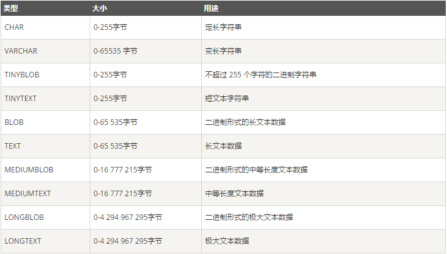
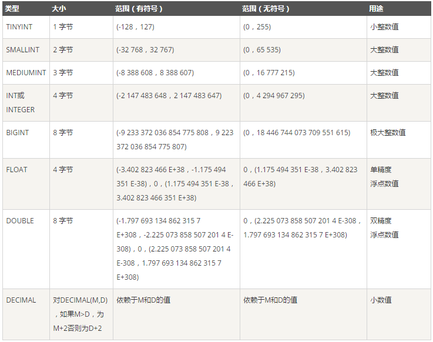
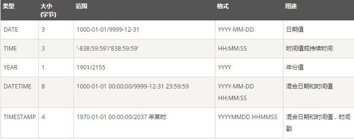

# Mysql数据库教程完整版 #
1.查询所有数据库

	show databases;

2.创建数据库mydb1

	create database mydb1;

3.查看新建的数据库细节

	show create database mydb1;

4.创建字符集为gbk的数据库mydb2

	create database mydb2 character set gbk;

5.创建一个使用gbk字符集，并带校对规则为gbk_chinese_ci的mydb3数据库；

	create database mydb3 character set gbk collate gbk_chinese_ci;

6.更改数据库mydb3的字符集；

	alter database mydb3 character set utf8;

7.选择数据库mydb3

	use database mydb3;

8.创建表

	create dable 表名(

		field1 datatype,
		field2 datatype,
		field3 datatype,
		... ...
		)character set 字符集 collate 校对规则;

	解释：（field:列名  datatype:数据类型）

9.MYSQL数据类型

- 字符串类型

- 
	
- 数值类型
	
- 
	
- 日期和时间类型
	
- 

10.创建表实例

	use mydb1；

	create table employee(
    id int,
	name varchar(100),
	gender varchar(10),
	job varchar(100),
	salary float(8,2),
	resume text);

11.查看表 

- 查看表细节

		create table employee;

- 查看表内容

		desc employee;

12.修改表

- 增加

		alter table employee add image blob;

- 修改
	
		alter table employee modify job varchar(60);

- 删除

		alter table employee drop image;

- 修改表名

		rename table employee to user;

- 修改表字符集

		alter table user character set utf8;

- 修改表内列名name为username

		alter table user change name username varchar(100);
	